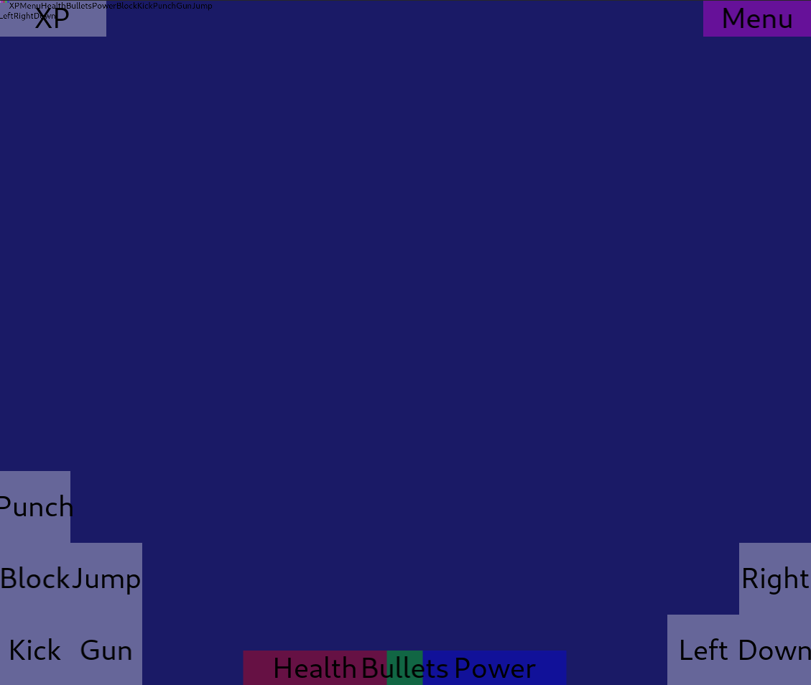

# cljs-gui
Game UI Renderer for ClojureScript



how to run :

```shadow-cljs watch app```

[Live Demo](https://milgra.github.io/cljs-gui/index.html)

## Features

* floating view generator and renderer
* font rendering
* view types : solid color view, textured view, button, slider, label

## Usage

* copy src/gui to your projects src folder
* check out layouts.cljc to see how to declare views
* check out core.cljs to see how to draw the ui/inject events

## Todo

* ne legyen kulon views uimap-ben, legyen egy lathatatlan base view, tartalmazhatja a kirajzolasi sorrendet is 
* slider mukodes
* tests
* data-flow diagram